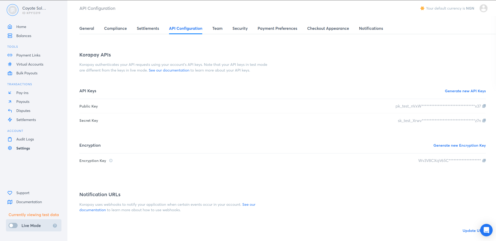

Clients are the core functionality that the `korapay_client` package provides. They are 
python classes that provide methods that perform the low level REST API calls to 
[Korapay](https://www.korahq.com/) hence providing these methods as a simpler interface
for interacting with [Korapay](https://www.korahq.com/) in your python project. Each methods
on the clients has a one to one mapping to the REST endpoints from 
[Korapay's REST API Reference](https://docs.korapay.com/). E.g., `KorapayClient.charge_via_card`
maps to `https://api.korapay.com/merchant/api/v1/charges/card`

`korapay_client` provides two client variants for interfacing with [Korapay](https://www.korahq.com/).
I.e., `KorapayClient` a synchronous client and `AsyncKorapayClient` an asynchronous client. a 
non-blocking copy of the `KorapayClient` useful in an asynchronous context. `AsyncKorapayClient`
methods fully mirrors methods on the `KorapayClient` except that the methods on the `AsyncKorapayClient`
are awaitable.

All the methods of a client abstracting low level REST calls to [Korapay](https://www.korahq.com/) have the
same return type a `Response` which is a pydantic model containing the `status_code`, `status`, `message`
and `data` fields representing the response returned by [Korapay](https://www.korahq.com/)

## Instantiating clients

The two variants of clients provided by the `korapay_client` package can be instantiated by passing the credentials
directly on class instantiation or by setting these credentials in your project's environmental variables. Credentials
provided on class instantiation are prioritized over credentials provided in the environmental variables. i.e., If you
have your korapay integration secret key set in your project's environmental variables, and you also provide a secret
key when instantiating the client classes, the clients will use the secret key you provided while instantiating the
client class.


!!! info "Where can I find my Korapay credentials?"

    Your korapay credentials like your public key, secret key and encryption are available to you after
    creating an account with [Korapay](https://www.korahq.com/). Log in to your korapay dashbord, in
    your settings page, go to the API Configuration tab. click on the image below to zoom.

    

!!! danger

    Providing your credentials to the clients on class instantiation is highly discouraged as your credentials are
    sensitive. The preferred way of providing your Korapay credentials to the client is via your project's 
    environmental variables.

### Instantiating clients by passing credentials directly on class instantiation

```python
from korapay_client import KorapayClient, AsyncKorapayClient

sync_client = KorapayClient(
    public_key="<your-public-key>",
    secret_key="<your-secret-key>",
    encryption_key="<your-encryption-key>")

async_client = AsyncKorapayClient(
    public_key="<your-public-key>",
    secret_key="<your-secret-key>",
    encryption_key="<your-encryption-key>")
```

### Instantiating clients by providing credentials in your environmental variables

```bash
export KORAPAY_PUBLIC_KEY=<your-public-key>
export KORAPAY_SECRET_KEY=<your-secret-key>
export KORAPAY_ENCRYPTION_KEY=<your-encryption-key>
```

```python
from korapay_client import KorapayClient, AsyncKorapayClient

sync_client = KorapayClient()

async_client = AsyncKorapayClient()
```

!!! note

    `korapay_client` requires you to provide your public key, secret key and encryption key even though it
    doesn't really use your public key and only uses your encryption key while process requests for card
    payments.